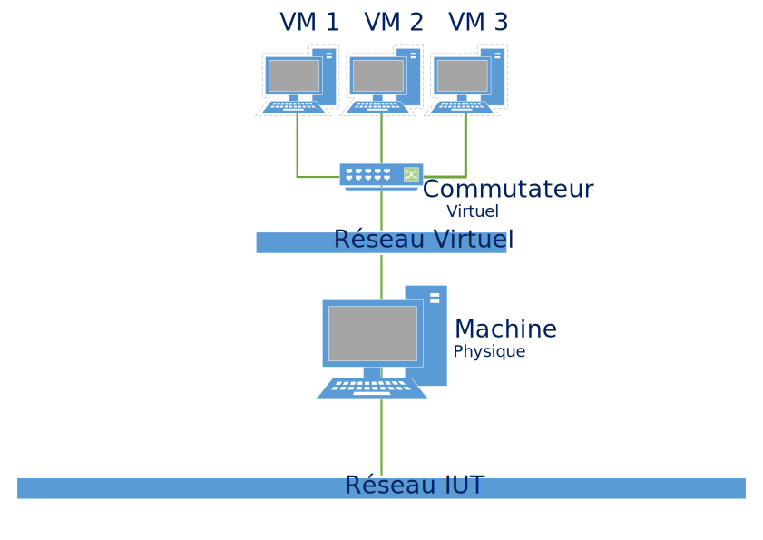

---
title : Réseau pour machines virtuelles

author :
- GERARD Cyril
- SZYMCZAK Jerome
- SALECKI Simon
- DUSART Clément
- HERBAUT Djezon

date: 16 mars 2018
logo:
- file: logo-cgir
  width: .15
- file: logo-univ-lille
...


# Cadre du projet

## Intitulé du sujet



## Contrainte

- Déployable sur Debian via un paquet
- Pas de redirection de port
- root nécessaire uniquement pour l'installation du paquet
- Communication entre VM sous Virtualbox obligatoire
- Faire communiquer des VMs sous VMware, QEMU/KVM, LXC...
- Fournir une documentation

## Gestion du projet

### Règles

- Dépôt GIT
     - dépôt particulier fait référence pour l'avancement du projet
     - rapport quotidien de chaque membre du projet
- Compte-rendu d'activité hebdomadaire chaque fin de semaine sur le dépôt
     - détaille les tâches effectuées et leur responsable
     - liste les éventuels points bloquants
     - liste sommairement les tâches planifiées pour la semaine suivante
     - précise la date et le lieu de la prochaine rencontre avec les tuteurs

### Outils utilisés
- GIT
- Markdown
- Mdoc

# Etat de l'art

## Différents virtualisateurs

- Définition de la virtualisation
    1. cloisonement
    2. transparence
    3. performances
    
- L'hyperviseur
    - type 1:
        - Xen, ESX, Hyper V
    - type 2:
        - VirtualBox, VmWare player
        
- L'isolateur
    - Docker,LXC,chroot
    
- L'émulateur
    - QEMU


## Comparatif


## Virtualbox


### Multi-plateforme
- Windows
- Linux
- Mac

### Plusieurs mode d'éxécution

- Un mode graphique

- Un mode ligne de commande
 grâce à la commande 'VBoxManage'
    - Quelques exemples
    
        - Création d'une machine virtuelle

    ~~~
    VBoxManage createvm –name debian9
    ~~~

        - Démarrage d'une machine virtuelle
    
    ~~~
    VBoxManage startvm debian9
    ~~~

## Les solutions existantes

- [VMnet de VMware](http://g.urroz.online.fr/doc/ch03s02.html)

- [Libvirt](https://libvirt.org/)

- [LXC](https://wiki.debian.org/fr/LXC/SimpleBridge)

- [TUN/TAP](https://www.inetdoc.net/guides/vm/vm.network.tun-tap.html)

- [Bridge-utils](https://wiki.debian.org/fr/BridgeNetworkConnections)

## Paquet Debian

Un paquet .deb, c'est un peu comme un programme d'installation .exe sous Windows, non ?

### Différences notables

- Il y a une gestion des dépendances du programme
- On n'a pas besoin de faire une recherche sur un moteur de recherche pour trouver un .deb.
- Tous les .deb sont rassemblés au même endroit sur un même serveur appelé dépôt (repository).

### Création d'un paquet Debian

- Un dossier contenant le nom du paquet, ses dépendances, etc.
- Les fichiers du programme.

Commande pour créer un paquet Debian

~~~
dpkg-deb --build monpaquet
~~~

## Exemple d'un paquet Debian

### myscript/

- `DEBIAN/`
    - `control` (fichier décrivant les informations relatives à notre paquet)
    - `preinst` (script exécuté après l'installation du paquet)
    - `postinst` (script exécuté après l'installation du paquet)
    - `prerm` (script exécuté après la désinstallation du paquet)
    - `postrm` (script exécuté après la désinstallation du paquet)
    - `md5sums` (permet la vérification de l'intégralité des données récupérées)
- `usr/`
    - `bin/`
        - `myscript` (notre script, exposé ci-dessus)
    - `share/doc/`
        - `README` (informations relatives à l'utilisation de myscript)
        - `copyright` 
        - `changelog` (changements apportés par rapport à la dernière version)
        - `changelog.Debian` (idem, mais seulement pour le paquet Debian)

## Solution retenu


# Mise en oeuvre du projet

## Création du script

Permet de configurer de l'interface créer par lxc-net.

```
usage: tarr-steps [OPTIONS] [VALEUR]

OPTIONS

    -h,  --help      affiche ce message d'aide
    -ip, --ip        change l'adresse ip du switch
    -l,  --liste     liste les informations liées au switch
    -c,  --check     vérifie que l'interface tap a bien été créer
    -st, --start     start sur le script lxc-net
    -sp, --stop      stop sur le script lxc-net
    -r,  --reload    reload sur le script lxc-net
```

## Création des fichiers de paquet

`mfbsflide`
- DEBIAN/
    - control
    - postinst
    - prerm
- usr/
    - /bin
        - tarr-steps.sh
    - share/doc/
        - lxc-net
        - tuto-kvm.md
        - tuto-virtualbox.md

## Fonctionnement du paquet


# Procédure de Test

## Test d'installation de notre paquet


## Test avec les virtualisateurs


# Conclusion
Ce que nous avons appris de ce projet et ce qu'il nous a apporté

