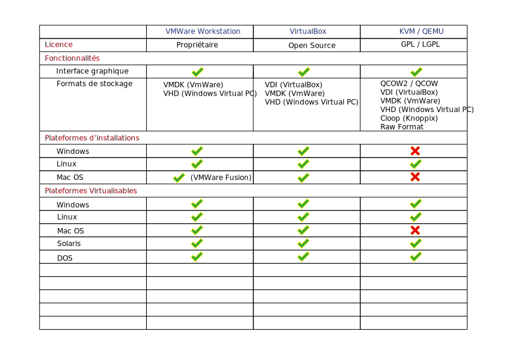

---
title : Réseau pour machines virtuelles

author :
- GERARD Cyril
- SZYMCZAK Jerome
- SALECKI Simon
- DUSART Clément
- HERBAUT Djezon

date: 16 mars 2018
logo:
- file: logo-cgir
  width: .15
- file: logo-univ-lille
...

# Cadre du projet

## Intitulé du sujet

## Contrainte

- Déployable sur Debian via un paquet
- Pas de redirection de port
- root nécessaire uniquement pour l'installation du paquet
- Communication entre VM sous Virtualbox obligatoire
- Faire communiquer des VMs sous VMware, QEMU/KVM, LXC...
- Fournir une documentation

## Gestion du projet

### Règles

- Dépôt GIT
     - dépôt particulier fait référence pour l'avancement du projet
     - rapport quotidien de chaque membre du projet
- Compte-rendu d'activité hebdomadaire chaque fin de semaine sur le dépôt
     - détaille les tâches effectuées et leur responsable
     - liste les éventuels points bloquants
     - liste sommairement les tâches planifiées pour la semaine suivante
     - précise la date et le lieu de la prochaine rencontre avec les tuteurs

### Outils utilisés
- GIT
- Markdown
- Mdoc

# Etat de l'art

## Différents virtualisateurs

- Définition de la virtualisation
- Les hyperviseurs
    - type 1:
        - Xen, ESX, Hyper V
    - type 2:
        - VirtualBox, VmWare player
- Les isolateurs
    - Docker,LXC,chroot
- Les émalateurs
    - QEMU

## Comparatif

## Virtualbox

- Licence GNU v2
- Multi-plateforme
- Un mode graphique
- Un mode ligne de commande/
    - vboxmanage

## Les solutions existantes

- [VMnet de VMware](http://g.urroz.online.fr/doc/ch03s02.html)

- [Libvirt](https://libvirt.org/)

- [LXC](https://wiki.debian.org/fr/LXC/SimpleBridge)

- [TUN/TAP](https://www.inetdoc.net/guides/vm/vm.network.tun-tap.html)

- [Bridge-utils](https://wiki.debian.org/fr/BridgeNetworkConnections)

## Paquet Debian

**Description :**
Un paquet .deb est en fait un dossier compressé contenant les éléments à installer et des informations sur le paquet. 
Comme l'indique l'extension, un paquet .deb est utilisé sur les systèmes reposant sur Debian.

**L'arborescence :**
Un paquet Debian est constitué de deux parties notables : 

- Un dossier contenant le nom du paquet, ses dépendances, etc.
- Les fichiers du programme.

**dossier-du-paquet/**

 - DEBIAN/
    - control
    - preinst
    - postinst
    - prerm
    - postrm
 - usr/
    - bin/
        - le-programme
    - share/doc/
        - README
        - autres fichiers

## Solution retenu

# Mise en oeuvre du projet

## Création du script

Permet de configurer de l'interface créer par lxc-net.

usage: tarr-steps [OPTIONS] [VALEUR]

OPTIONS

    -h,  --help          affiche ce message d'aide
    -ip, --ip            change l'adresse ip du switch
    -l,  --liste         liste les informations liées au switch
    -c,  --check         vérifie que l'interface tap a bien été créer
    -st, --start         start sur le script lxc-net
    -sp, --stop          stop sur le script lxc-net
    -r,  --reload        reload sur le script lxc-net

## Création des fichiers de paquet

- DEBIAN/
    - control
    - postinst
    - prerm
- usr/
    - /bin
        - tarr-steps.sh
    - share/doc/
        - lxc-net
        - tuto-kvm.md
        - tuto-virtualbox.md

## Fonctionnement du paquet

'image jerome'

# Procédure de Test

## Test d'installation de notre paquet

## Test avec les virtualisateurs

# Conclusion
Ce que nous avons appris de ce projet et ce qu'il nous a apporté

